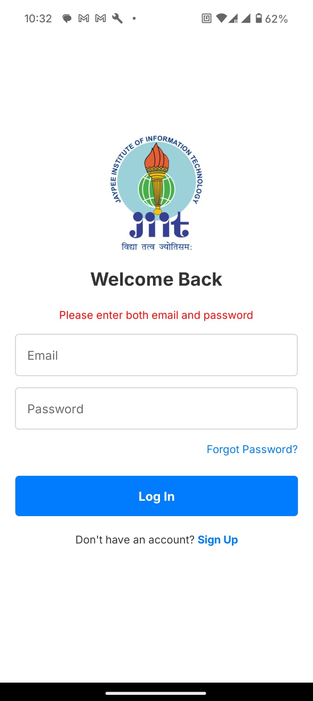
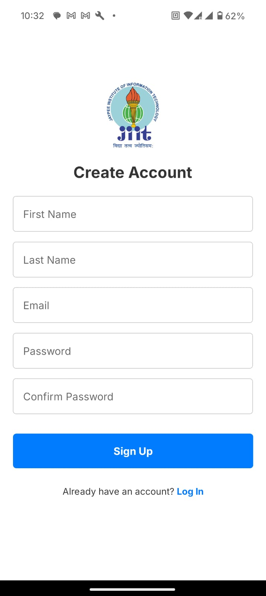
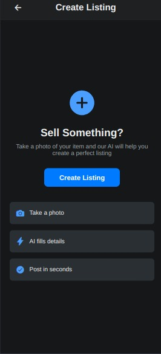
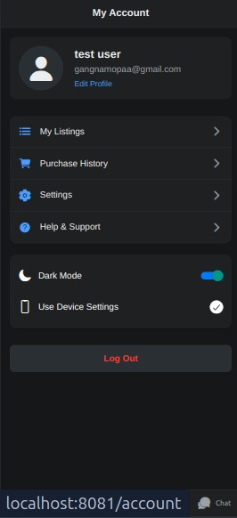

# 🛍️ JIITQuickList

**JIITQuickList** is a college-centric online marketplace mobile app built with **React Native + Expo**, designed exclusively for the students of **JIIT Sector 62**. Think of it as your campus OLX — a place to quickly list, browse, and buy/sell anything from books and electronics to furniture and bikes, all within your trusted student community.

Whether you're moving hostels, graduating, or just cleaning up, JIITQuickList lets you declutter and help someone else in the process — sustainably and affordably.

---

## 🚀 Live Demo

> 📲 Coming Soon: This app will be available on the Expo Go App and eventually published to the Play Store.

---

## 📱 Screenshots

| Home | Create Account | Forgot Password |
|------|------------------|-------------|
|  |  |  |

## Other Images

|  |  |  |  |

---

## 🎯 Features

- 🧾 **Post Listings:** Sell any item with just a few taps.
- 📸 **Image Upload:** Upload images using camera or gallery.
- 🔍 **Smart Search:** Search by item name or category.
- 🧑 **User Profiles:** View all items listed by a student.
- 💬 **Chat (Planned):** Start a conversation with interested buyers/sellers.
- 🔐 **Secure Login:** Firebase-powered Google/Email auth.
- 🏫 **Campus-Limited:** Listings visible only to JIIT students.
- 📥 **Saved Listings (Planned):** Bookmark items to revisit later.

---

## 💡 Motivation

College campuses often face the issue of unused items piling up while others are in need of them. Students often rely on unreliable WhatsApp groups or word of mouth. **JIITQuickList** bridges this gap by providing:

- A **centralized** and **trusted** platform,
- Fast listing and discovery of items,
- Campus-only access to avoid scams.

Let’s make sustainability and affordability a norm on campus!

---

## ⚙️ How It Works

1. **Sign In:** Use your email to sign in securely via Firebase Auth.
2. **List an Item:** Add title, description, category, price, and images.
3. **Discover:** Browse or search through items posted by other students.
4. **Connect (soon):** Message the seller to discuss and finalize the deal.
5. **Manage Listings:** View, update, or delete your posted items anytime.

---

## 📦 Built With

| Tech                | Purpose                                   |
|---------------------|--------------------------------------------|
| [React Native](https://reactnative.dev/) | Cross-platform mobile app framework |
| [Expo](https://expo.dev/) | Tools & services for React Native apps |
| [MongoDB](https://mongodb.com/) | For database |
| [React Navigation](https://reactnavigation.org/) | Navigation between screens |
| [Jest](https://www.jest.dev/) | For testing purposes |
| [Gemini API](https://gemini.google.com/) | For fetching details |

---

